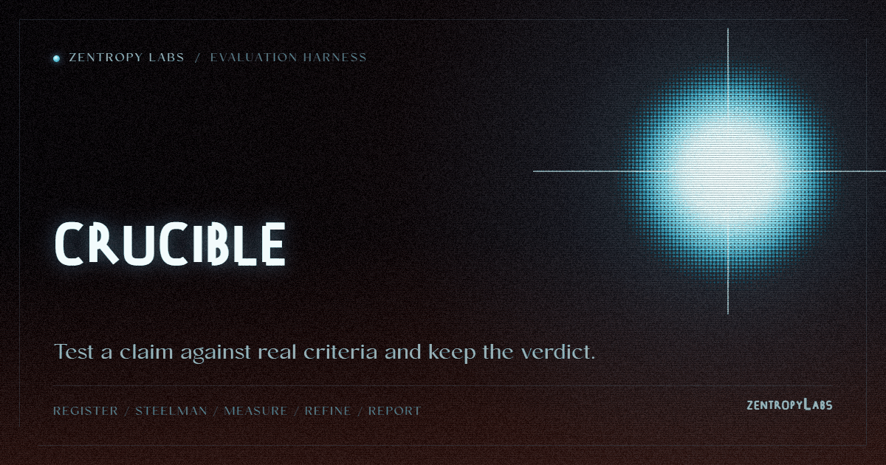

<p align="center"></p>

**A judgment engine: register a thesis, steelman each claim, measure against a substrate, refine the weakest axis.**

[](https://pypi.org/project/crucible-bench/)

[](https://github.com/HarperZ9/crucible/actions/workflows/ci.yml)
[](https://pypi.org/project/crucible-bench/)


crucible turns a thesis into a set of claims, each paired with the observation that would refute it. Independent adversaries steelman every claim by proposing the strongest test, the engine measures each one against a substrate oracle, and the weakest axis gets refined across rounds: strengthen the substrate, sharpen the measurement, or amend the thesis. The result is a verdict per claim, MATCH, DRIFT, or UNVERIFIABLE, grounded in the measurement rather than a judge's opinion. Every run writes a record you can re-check.

[Project Telos](https://harperz9.github.io) | [gather](https://github.com/HarperZ9/gather) | [crucible](https://github.com/HarperZ9/crucible) | [index](https://github.com/HarperZ9/index) | [forum](https://github.com/HarperZ9/forum) | [telos](https://github.com/HarperZ9/telos) | [learn](https://github.com/HarperZ9/learn) | [emet](https://github.com/HarperZ9/emet) | [buildlang](https://github.com/HarperZ9/buildlang)

## Current status

`crucible-bench 1.2.0` is the current source version. The judgment loop,
cleanroom review packets, sealed registry, drift and CI gates, measurement
adapters, CLI, Python API, and MCP surface are present; verdicts remain
UNVERIFIABLE when the required evidence is absent.

## Operator surface

Use `crucible status --json` and `crucible doctor --json` to inspect the local
installation, then `crucible mcp` to expose assessment, review, registry, and
measurement-gate operations to an MCP host. `crucible ci` is the regression
entrypoint for a sealed baseline.

## Highlights

- **Verdicts that recompute from the record.** `verdict_for(claim, measurement)` is a pure function: within tolerance is MATCH, outside is DRIFT, absent or unmeasurable is UNVERIFIABLE, fail-closed. No model sits in the verdict step, so a fluent assertion cannot move a rechecked result.
- **One-command runs with cleanroom review packets.** `crucible run --bundle DIR` executes steelman, measurement, witnessed assessment, and disk recheck in one session, then writes a self-contained verifier packet (`spec.json`, `run.json`, `report.md`, `review.md`). `crucible review DIR` validates the packet boundary before handoff.
- **A CI regression check.** `crucible ci` compares a registry's verified-latest verdicts against a sealed baseline, exits nonzero when any claim loses standing, and emits a deterministic PR-comment Markdown matrix. New in 1.2.0.
- **A refine loop that names the weakest claim.** Grade each claim's measured margin, compute harmonic-mean cohesion, and re-measure across substrate rounds until the thesis is cohesively verified or the budget is spent. The loop reports the weakest axis instead of pretending a short thesis held.
- **Drift tracking across rounds.** `crucible drift` compares the latest two witnessed assessments and classifies each claim as held, moved, improved, or regressed.
- **LLM-as-judge with the model outside the verdict.** `JudgeMeasure` scores freeform outputs against a rubric; the judge produces a deviation once at the seam, the verdict still derives from `verdict_for`, and a judge that raises or returns garbage fails closed. New in 1.2.0.
- **Oracle recheck packs.** `crucible recheck` lists descriptor-bearing measurements, writes `crucible.replay-template/1` templates, and validates `crucible.replay-pack/1` inputs against the sealed rows without opening a second verdict path. A privacy-bounded `crucible.replay-set/1` binding covers the descriptor-bearing replay contracts without exporting descriptorless rows or their evidence. CLI replay packs must preserve the template's assessment binding; a missing or mismatched thesis ID, assessment seal, or measurement seal fails closed before replay.
- **A content-addressed registry with tamper detection.** Every claim carries a sha256 receipt; the registry re-verifies stored claims (MATCH / MISSING / CORRUPT), checks thesis seals, rejects duplicate ids with different seals, and refuses tampered theses.
- **Typed missing-evidence explanations.** Every UNVERIFIABLE verdict names the exact evidence class it lacks and the concrete next action, derived from the same pure ladder as the verdict, so the explanation can never disagree with it. New in 1.2.0.
- **Batch manifests, Markdown reports, creative measurement gates, native MCP.** `crucible batch` runs a manifest of theses into one registry, `crucible report` renders deterministic Markdown, `crucible measurement-gate` verifies Telos creative measurement packets, and `crucible mcp` serves 13 tools over stdio.
- **Zero third-party runtime dependencies.** The core is pure standard library, Python 3.11+.

## Install

```bash
pip install crucible-bench
```

The distribution is `crucible-bench`; it installs the `crucible` command and the `crucible` package (`import crucible`). For the examples and the newest commands, work from a clone:

```bash
git clone https://github.com/HarperZ9/crucible
cd crucible
pip install -e ".[dev]"
```

## Quickstart

Run the bundled demo from a clone. It registers a three-claim thesis, steelmans it, assesses it, and then shows tampering being caught:

```bash
python examples/demo.py
```

```text
thesis "Binary search comparison bounds": 3 claims, seal bd7404c02eb2...
  MATCH        deviation 0 within tolerance 0.5
  DRIFT        deviation 8 exceeds tolerance 0.5
  UNVERIFIABLE claim states no falsification condition
counts: MATCH 1  DRIFT 1  UNVERIFIABLE 1
assessment seal 07dafef03f5c..., verified True
after flipping a DRIFT to a MATCH, verified False  <- caught
```

Then run the same thesis through the full loop into a registry:

```bash
crucible run examples/thesis-binary-search.json \
  --measurements examples/measurements-binary-search.json \
  --registry .crucible-registry
```

```text
ran thesis bd7404c02eb2036e: 3 claim(s)
  steelman refutations: 3
  MATCH 1  DRIFT 1  UNVERIFIABLE 1
  assessment seal: 62f928fe21052041...
  re-derived from disk: True  {'seals_ok': True, 'thesis_ok': True, 'verdicts_rederive': True}
```

Add `--json` for the machine-readable run record, `--substrate examples/substrate-binary-search.json` instead of `--measurements` to go through the table oracle, and `--bundle DIR` to write a cleanroom review packet. A visual verdict surface lives at [`examples/crucible-demo.html`](examples/crucible-demo.html).

## A worked example

A thesis is claims plus falsification conditions:

```json
{
  "title": "Binary search comparison bounds",
  "disposition": "publishable",
  "claims": [
    {
      "text": "binary search over a sorted array of 1024 elements does at most 11 comparisons",
      "falsification": "a measured worst-case comparison count above 11 for n=1024"
    },
    {
      "text": "binary search is more elegant than linear search",
      "falsification": ""
    }
  ]
}
```

The first claim is measurable: a measurement row binds to it by content hash, records a deviation and a tolerance, and the verdict follows. The second claim states no falsification condition, so it is UNVERIFIABLE by construction, and the assessment says exactly which evidence class is missing. Run it, bundle it, and validate the packet:

```bash
crucible run thesis.json --measurements measurements.json \
  --registry .crucible-registry --bundle reports/my-run
crucible review reports/my-run
```

The bundle gives a verifier only the spec and the artifact, with packet-relative paths. `review` fails closed on missing files, extra context, a `spec.json` that drifted from the run record, or a `report.md` that no longer renders from `run.json`.

To gate pull requests on the registry:

```bash
crucible ci .crucible-registry --write-baseline crucible-baseline.json   # on a known-good commit
crucible ci .crucible-registry --baseline crucible-baseline.json --out crucible-ci.md
```

A regression is a claim moving MATCH to DRIFT, becoming UNVERIFIABLE, or dropping out of the verified-latest set. The baseline seals its own cells, so a hand-edited baseline is rejected on load. The Markdown summary is deterministic and references the assessment seal behind every cell.

## Command surface

| Command | What it does |
| --- | --- |
| `crucible run THESIS --measurements F \| --substrate F` | full loop in one session; `--bundle DIR` writes a review packet |
| `crucible register / assess / steelman / measure` | the individual loop stages |
| `crucible review BUNDLE` | validate a cleanroom packet before verifier handoff |
| `crucible refine CONFIG` | rounds of substrate refinement toward cohesive verification |
| `crucible drift DIR` | classify claim movement between the latest two assessments |
| `crucible ci DIR` | regression gate against a sealed baseline |
| `crucible recheck DIR` | inspect, template, or replay oracle measurement descriptors |
| `crucible registry list\|verify\|stats\|search\|prune` | registry operations, including `--require-witnessed-match` |
| `crucible verdicts DIR [--verify]` | list or re-derive witnessed assessments |
| `crucible report DIR` / `crucible batch MANIFEST` | Markdown reports; manifest runs into one registry |
| `crucible export THESIS` | publication-gated export; fenced material is refused at the edge |
| `crucible measurement-gate PACKET` | verify a Telos creative measurement packet |
| `crucible status / doctor / demo` | operator envelope, readiness checks, demo pointer (`--json`) |
| `crucible mcp` | serve the 13 crucible tools over MCP stdio |

Every command works identically from a source checkout via `python -m crucible`.

## Extending the seams

The steelman and measure stages are seams with a stable API shape. Defaults are Null (propose nothing, measure nothing, UNVERIFIABLE), and the shipped edges include:

- `TableMeasure`: offline deviation against a provided substrate table, no model.
- `SubprocessSteelman` / `SubprocessMeasure`: configured commands over bounded JSON stdin/stdout, with timeouts, no shell strings, minimal environment, and output caps.
- `TelosMeasure`: consumes `telos.witnessed-artifact/v1` envelopes and re-runs the named verifier rather than trusting the carried certificate.
- `GatherDigestMeasure` / `IndexMeasure`: sealed [gather](https://github.com/HarperZ9/gather) digests as evidence, and `index.verification/1` records replayed against graph packs.
- `JudgeMeasure`: rubric-scored LLM judging behind an injectable backend, deterministic stub in tests, null by default.
- `ProofMeasure`: a proof or type checker (Lean, Coq, a type checker, any command) as the oracle for formal claims. It runs the checker over the claim's artifact: an accepted proof is MATCH, a rejected one DRIFTs, and a checker that is absent or errors is UNVERIFIABLE, fail-closed, so an unrun checker never reports a proof as holding. The measurement binds the exact command and the artifact hash, so a stranger replays the identical check. This is the oracle for the north star, verified discovery in math.

All edges map into the same `Measurement` to `verdict_for` spine. The verdict step never changes.

## Documentation

- [docs/INTRODUCTION.md](docs/INTRODUCTION.md): what crucible is, core concepts, and a first-ten-minutes walkthrough.
- [ARCHITECTURE.md](ARCHITECTURE.md): module layout and the pure/impure boundary.
- [USAGE.md](USAGE.md): operator commands and the interop boundary.
- [docs/ENTERPRISE-READINESS.md](docs/ENTERPRISE-READINESS.md): the host-integration contract for unattended agent workflows.
- [docs/RELEASE-READINESS.md](docs/RELEASE-READINESS.md): the 1.0 gate checklist.
- [CHANGELOG.md](CHANGELOG.md): per-release detail, including what is merged but not yet on PyPI.

## Status

`crucible-bench 1.2.0` covers the full loop, one-command runs, cleanroom review packets, oracle replay, registry operations, creative measurement gates, and the MCP bridge, plus what landed since 1.1.0: the CI regression gate, LLM-as-judge, missing-evidence explanations, ill-posed measurement warnings, and the MATCH-provenance gate. The test suite currently collects 330 tests. Within Project Telos, crucible is the measured-judgment layer: it consumes gather evidence and index context and emits verdict packets that telos can surface and replay.

## Why it matters

Everything above reduces to one property: a verdict is a pure function of a sealed record, so anyone holding the record can recompute it, and a tampered claim, measurement, or baseline is caught by re-hashing rather than by trust.

## License

crucible is fair-source: open to read, run, and build on, with commercial use reserved so the project can fund its own development. See [LICENSE](LICENSE) for the exact terms.

## Work with it

```bash
python -m pip install -e ".[dev]"
python -m pytest
```

Keep the README, package metadata, and examples aligned with current behavior before opening a PR.

## What this believes

This tool is one tool in a family that holds a single belief steady across
every surface: knowledge open to anyone who can attain the means; acceptance
decided by external checks, never reputation; every result re-runnable;
honest nulls first-class; ownership earned by comprehension; learning woven
into the work. The full text lives in [CREDO.md](CREDO.md).
The long form of this belief: [The Unbundling](https://github.com/HarperZ9/flywheel/blob/fix/release-model-identity/docs/essays/2026-07-13-the-unbundling.md).

---

**[Zentropy Labs](https://github.com/ZentropyLabs-ai)** · order out of entropy. An independent lab building evidence-first tools that leave a re-checkable artifact behind. Built by Zain Dana Harper in Seattle. The full workbench is at [Project Telos](https://harperz9.github.io).
